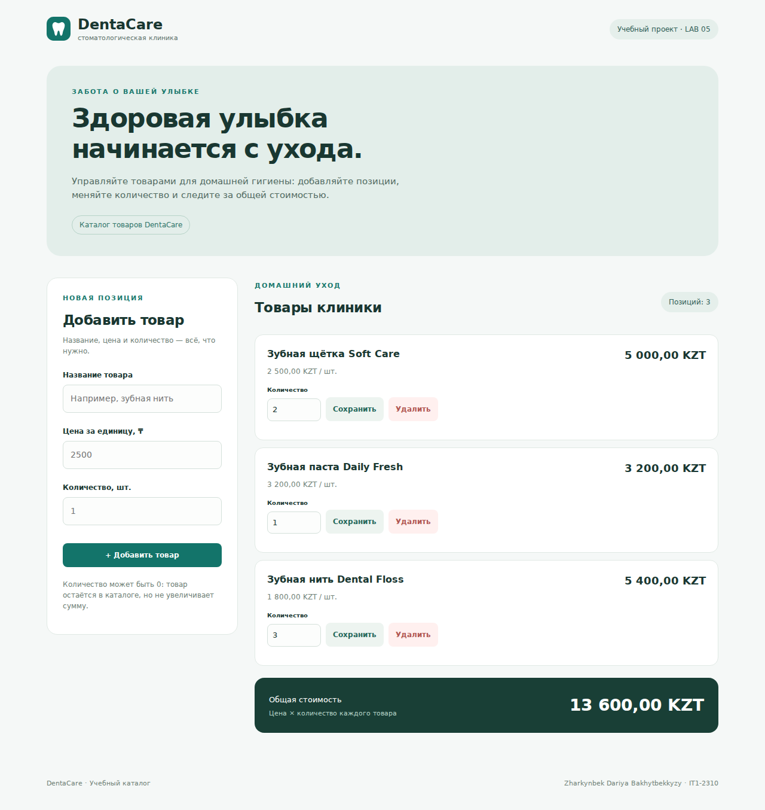

# DentaCare — Lab 5: DOM, events, forms

**Student:** Zharkynbek Dariya Bakhytbekkyzy · **Group:** IT1-2310

Каталог товаров стоматологической клиники на чистом JavaScript и DOM API.

## Как открыть

Скачайте репозиторий и откройте `index.html` в браузере. Сборка, установка пакетов и сервер не нужны. Скрипты подключаются обычными `<script defer>`, поэтому страница открывается даже через `file://`.

## Возможности

- Список товаров строится из `Store` из лабы 4.
- Форма добавления: ошибки у каждого поля в DOM, без `alert`.
- Изменение количества кнопкой «Сохранить» или Enter, удаление кнопкой «Удалить».
- Живая общая сумма после каждого успешного изменения без перезагрузки.
- Пустой каталог, нулевое количество, адаптивная страница.

Количество — целое число от 0 до 1 000 000. Пустое поле не превращается в 0: `readNumber` возвращает `NaN`. Цена — больше 0, не выше 1 млрд ₸. Для учебных вычислений сумма считается в тиынах. Данные хранятся в памяти: перезагрузка возвращает исходные три товара.

## События: что обработано и почему

Я обрабатываю событие `submit`, чтобы добавлять товар и сохранять количество как кнопкой, так и клавишей Enter. На общем контейнере `#store-panel`, который содержит список и форму добавления, установлен один делегированный обработчик `submit`: событие всплывает от вложенных форм. По `event.submitter.dataset.action` и `form.dataset.action` обработчик выбирает `add`, `remove` или `update`, поэтому новым карточкам не нужны отдельные слушатели. `event.preventDefault()` предотвращает перезагрузку страницы, а после изменения Store функция `render()` обновляет список и сумму. Ошибки показываются через `textContent` рядом с полями, а имена товаров тоже вставляются как текст.

## Структура

- `index.html` — разметка.
- `style.css` — оформление и адаптивность.
- `src/Store.js` — та же модель данных, что в лабе 4.
- `app.js` — DOM, делегирование и валидация формы.
- `assets/` — значок и скриншоты.

## Скриншот

[Мобильный скриншот](assets/screenshot-mobile.png)

## ИИ

При подготовке кода, оформления, тестовых проверок и объяснений использован ChatGPT (Codex). Перед защитой необходимо изучить свой код.
